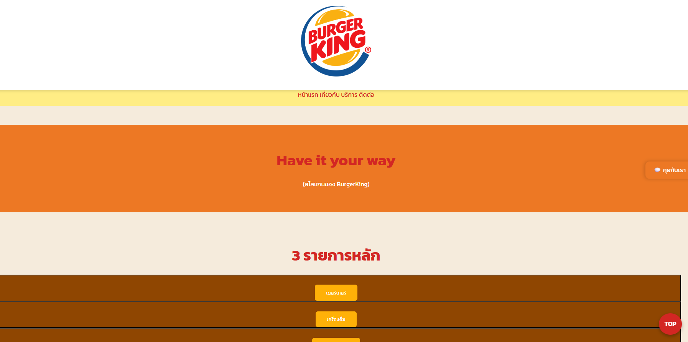
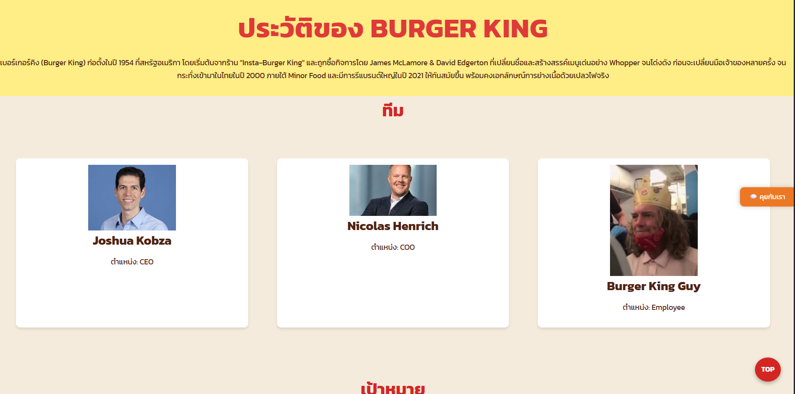
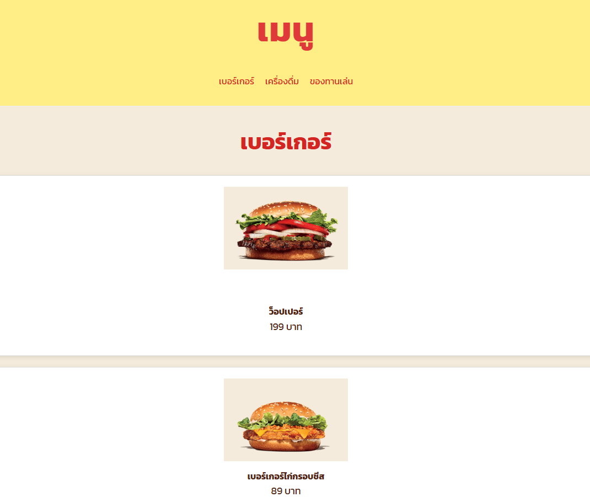
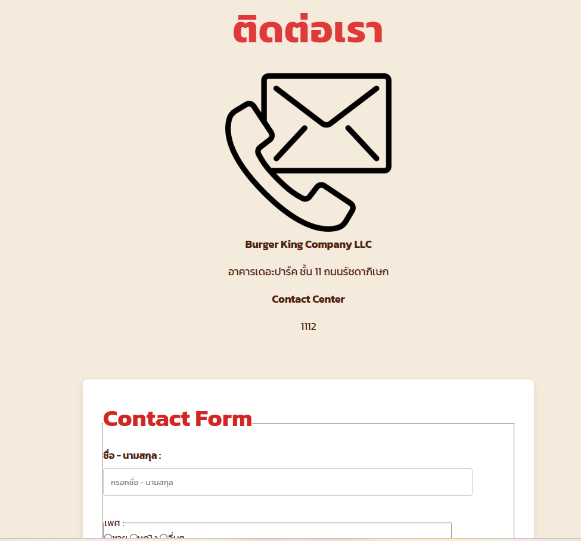

# Create Burger King website
## Project description
- นี่เป็นการจำลองหน้าเว็บไซต์ Burger King 
สร้างขึ้นเพื่อเรียนรู้เกี่ยวกับวิธีสร้างและการตกแต่งหน้าเว็บไซต์ 
โดยไม่ใช้ JavaScript ในการเขียน
เพื่อเป็นการศึกษาเกี่ยวกับ HTML และ CSS เบื้องต้น
## File structure
```
my-business-web/
├── index.html
├── about.html
├── services.html
├── contact.html
├── css/
│   └── styles.css
├── Pictures/
│   └── ...
└── README.md

```

## CSS Implementation Checklist
- [x] Universal Selector & Reset
- [x] Element Selectors (h1-h4, p, a, etc.)
- [x] Class Selectors (.hero, .card, .btn, etc.)
- [x] ID Selectors (#header, #footer)
- [x] Pseudo-classes (:hover, :active, :first-child)
- [x] CSS Units (px, rem, %, vw, vh)
- [x] Color Palette & Typography
- [x] Box Model (padding, margin, border)
- [x] Positioning (sticky, absolute, fixed)
- [x] Display & Layout (flexbox, grid)
- [x] Hover Effects & Transitions
- [x] CSS Organization & Comments

## Screenshots and Links
1.  [หน้าหลัก /index.html](/index.html)

    [](/index.html)

2.  [เกี่ยวกับ /about.html](/about.html)

    [](/about.html)

3.  [บริการ /services.html](/services.html)

    [](/services.html)

4.  [ติดต่อ /contact.html](/contact.html)

    [](/contact.html)