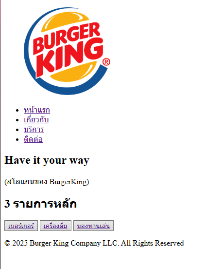
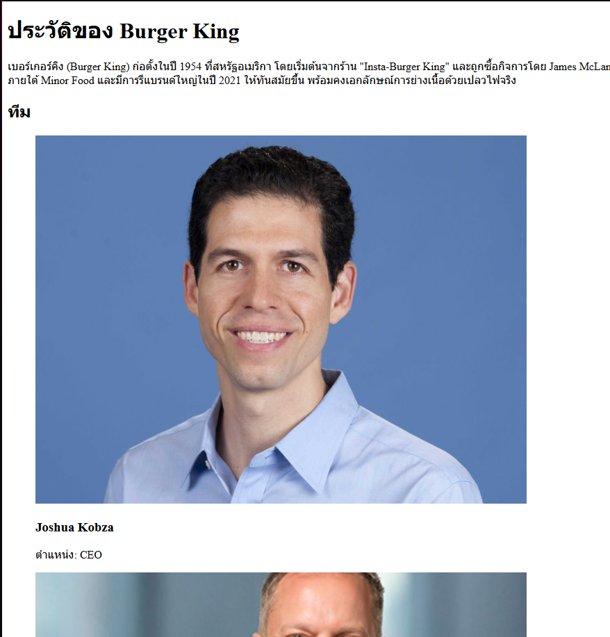

# Create Burger King website
## Projecet description
- นี่คือการจำลองหน้าเว็บไซต์ Burger King 
- สร้างขึ้นเพื่อเรียนรู้เกี่ยวกับวิธีสร้างหน้าเว็บไซต์ 
- ไม่ใช้ CSS และ JavaScript ในการเขียน
- เพื่อศึกษาเกี่ยวกับ HTML เบื้องต้น
## File structure
- **index.html** - หน้าหลักสำหรับเว็บไซต์
- **about.html** - หน้าเกี่ยวกับ อธิบายเรื่องราว และเป้าหมายของบริษัท
- **services.html** - หน้าบริการ บอกรายละเอียดเกี่ยวกับการบริการของเรา
- **contact.html** - หน้าติดต่อ บอกสถานที่ตั้งบริษัท และใช้สำหรับพูดคุยกับเรา
- **images/** - โฟลเดอร์สำหรับจัดเก็บไฟล์รูปภาพที่ใช้ในหน้าเว็บไซต์
- **README.md** - เอกสารสำหรับอธิบายโครงการ
## Screenshots and Links
1.  [หน้าหลัก /index.html](/index.html)

    

2.  [เกี่ยวกับ /about.html](/about.html)

    

3.  [บริการ /services.html](/services.html)

    

4.  [ติดต่อ /contact.html](/contact.html)

    